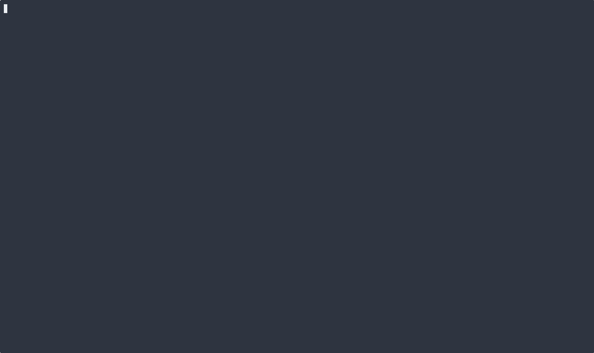

# dotfiles

Contains all the dotfiles that I use in my development environment.

## Install Tools - Requirements

- git - `sudo apt install git`
- zsh - `sudo apt install zsh`
- carapace - `brew install carapace`
- bat - `brew install bat`
- starship - `curl -sS https://starship.rs/install.sh | sh`
- neovim - [See more](https://github.com/neovim/neovim/blob/master/INSTALL.md)
- fzf - `sudo apt install fzf`
- Atuin - `curl --proto '=https' --tlsv1.2 -LsSf https://setup.atuin.sh | sh`
- ripgrep - `sudo apt install ripgrep`
- lazygit - `brew install lazygit`
- tmux - `sudo apt install tmux`
- tpm - `git clone https://github.com/tmux-plugins/tpm ~/.config/tmux/plugins/tpm`
- stow - `sudo apt install stow`
- Gitmux - `brew tap arl/arl && brew install gitmux`
- Asciinema - `brew install asciinema agg`
- Zoxide - `brew install zoxide`

## Other nicities

### Pacstall

`sudo apt install pacstall`

- noisetorch-bin
- pacup
- zen-browser-bin

### Snap

```sh
snap install nvim
snap install raindrop
snap install ticktick
```

### Flatpak

Discord Canary
TLP-UI
Touché
Flatseal
Spotify
Transmission
Visual Studio Code
BibleTime
Kooha
Smile
Blender
darktable
GIMP
WhiteSur-Dark Gtk theme
WhiteSur-Dark-solid Gtk theme
Kdenlive
Krita
Zoom

### Brew

```sh
brew install dust fd eza dua-cli ripgrep
brew install python
brew install unzip
brew install glow
brew install jj lazygit
brew install zizmor
brew install pandoc
brew install sqlite
brew install k9s helm age agg
```

## Usage

```sh
stow -v2 .
stow -v2 -t ~/.local -S dot-local --dotfiles
stow -v2 -t ~ -S zsh gitmux --dotfiles
chsh -s /bin/zsh
tmux source-file ${XDG_CONFIG_HOME:-$HOME/.config}/tmux/tmux.conf
bat cache --build
```

## Note for WSL

In WSL, the locale is not updated by default. Ensure it's updated to use UTF-8 and English.

Run the below, then restart the terminal/tmux session.

```sh
sudo apt-get install language-pack-en language-pack-en-base manpages
sudo update-locale LANG=en_US.UTF8
```

# Recording

```sh
asciinema rec demo.cast
agg --theme nord --font-size 16 --font-family "DankMono Nerd Font" demo.cast ~/Pictures/demo.gif && rm demo.cast
```


